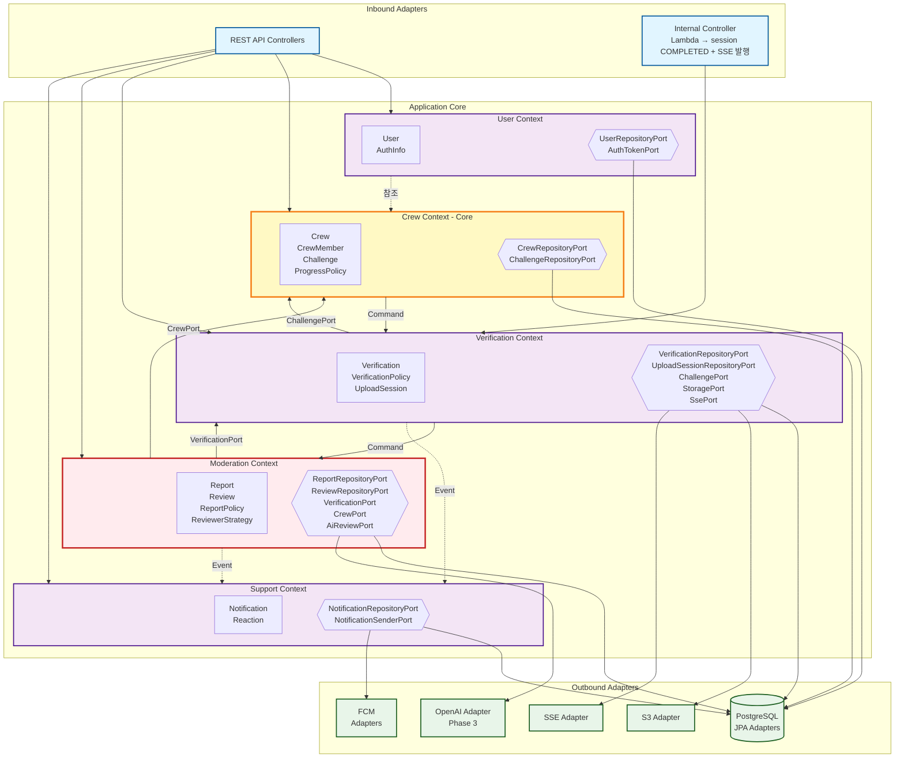

# Architecture - 헥사고날 아키텍처 상세

## 1. 시스템 아키텍처 (Phase 1)

Phase 1은 단일 Spring Boot 애플리케이션을 중심으로 구성된다.
내부 저장소(Data Layer)와 외부 의존성(External Services)을 명확히 분리하여
확장성과 장애 대응 전략 수립이 가능하도록 설계하였다.

## 2. 헥사고날 아키텍처 (간략)



## 3. 헥사고날 아키텍처 (상세)

```mermaid
graph TB
    subgraph "Inbound Adapters"
        REST[REST API Controllers]
    end
    
    subgraph "Application Core"
        subgraph UC[User Context]
            UDomain[User<br/>AuthInfo]
            UPort{{UserRepositoryPort<br/>AuthTokenPort}}
        end
        
        subgraph CC[Crew Context - Core]
            CDomain[Crew<br/>CrewMember<br/>Challenge<br/>ProgressPolicy]
            CPort{{CrewRepositoryPort<br/>ChallengeRepositoryPort}}
        end
        
        subgraph VC[Verification Context]
            VDomain[Verification<br/>VerificationPolicy<br/>UploadSession]
            VPort{{VerificationRepositoryPort<br/>ChallengePort<br/>StoragePort}}
        end
        
        subgraph MC[Moderation Context]
            MDomain[Report<br/>Review<br/>ReportPolicy<br/>ReviewerStrategy]
            MPort{{ReportRepositoryPort<br/>ReviewRepositoryPort<br/>VerificationPort<br/>CrewPort<br/>AiReviewPort}}
        end
        
        subgraph SC[Support Context]
            SDomain[Notification<br/>Reaction]
            SPort{{NotificationRepositoryPort<br/>NotificationSenderPort}}
        end
    end
    
    subgraph "Outbound Adapters"
        subgraph "Persistence"
            UserRepo[UserRepoAdapter]
            CrewRepo[CrewRepoAdapter]
            VerRepo[VerificationRepoAdapter]
            ReportRepo[ReportRepoAdapter]
            ReviewRepo[ReviewRepoAdapter]
            NotiRepo[NotificationRepoAdapter]
        end
        
        subgraph "External Services"
            S3[S3PresignAdapter]
            SSE[SseEmitterAdapter]
            AI[OpenAiAdapter<br/>Phase 3]
            FCM[FcmAdapter<br/>Phase 2]
        end
        
        subgraph "Internal Services"
            ChallengeClient[ChallengeClientAdapter]
            VerClient[VerificationClientAdapter]
            CrewClient[CrewClientAdapter]
        end
    end
    
    subgraph "Infrastructure"
        DB[(PostgreSQL)]
        S3Storage[AWS S3]
        OpenAI[OpenAI API<br/>Phase 3]
        Firebase[Firebase FCM<br/>Phase 2]
    end
    
    REST --> UC
    REST --> CC
    REST --> VC
    REST --> MC
    REST --> SC
    Internal --> VC

    UC -.->|참조| CC
    CC -->|Command| VC
    VC -->|Command| MC
    VC -.->|Event| SC
    MC -.->|Event| SC

    VPort -.->|ChallengePort| ChallengeClient
    VPort --> SSE
    MPort -.->|VerificationPort| VerClient
    MPort -.->|CrewPort| CrewClient
    
    ChallengeClient --> CC
    VerClient --> VC
    CrewClient --> CC
    
    UPort --> UserRepo
    CPort --> CrewRepo
    VPort --> VerRepo
    VPort --> S3
    MPort --> ReportRepo
    MPort --> ReviewRepo
    MPort --> AI
    SPort --> NotiRepo
    SPort --> FCM
    
    UserRepo --> DB
    CrewRepo --> DB
    VerRepo --> DB
    ReportRepo --> DB
    ReviewRepo --> DB
    NotiRepo --> DB
    S3 --> S3Storage
    AI --> OpenAI
    FCM --> Firebase
    
    classDef primary fill:#e1f5ff,stroke:#01579b,stroke-width:2px
    classDef core fill:#fff9c4,stroke:#f57f17,stroke-width:3px
    classDef context fill:#f3e5f5,stroke:#4a148c,stroke-width:2px
    classDef new fill:#ffebee,stroke:#c62828,stroke-width:3px
    classDef adapter fill:#e8f5e9,stroke:#1b5e20,stroke-width:2px
    classDef infra fill:#fafafa,stroke:#424242,stroke-width:2px
    classDef phase2 fill:#e0f7fa,stroke:#006064,stroke-width:2px,stroke-dasharray: 5 5
    
    class REST,Internal primary
    class CC core
    class UC,VC,SC context
    class MC new
    class UserRepo,CrewRepo,VerRepo,ReportRepo,ReviewRepo,NotiRepo,S3,SSE,AI,ChallengeClient,VerClient,CrewClient adapter
    class FCM phase2
    class DB,S3Storage,OpenAI,Firebase infra
```



## 4. 패키지 구조

```
com.jaksam
├── user/              // User Context
├── crew/              // Crew Context (Core)
├── verification/      // Verification Context
├── moderation/        // Moderation Context
└── support/           // Support Context

// 각 컨텍스트 내부 구조
com.jaksam.{context}
├── api/               // Controller, Request/Response DTO
├── application/       // UseCase 구현체
├── domain/
│   ├── model/         // Entity, Aggregate Root
│   └── vo/            // Value Object
├── port/
│   ├── in/            // UseCase 인터페이스
│   └── out/           // Repository Port, External Port
└── infra/             // JPA, MyBatis, S3, SSE Adapter
```

## 5. 컨텍스트 간 통신 규칙

| 방식 | 설명 | 사용처 |
|------|------|--------|
| Command (동기) | Port를 통한 직접 호출 | Crew → Verification, Verification → Moderation |
| Event (비동기) | 이벤트 발행/구독 | Verification → Support, Moderation → Support |
| 참조 | ID 기반 조회 | User Context 참조 |

**원칙:**
- Aggregate 간 참조는 ID로만 한다
- 컨텍스트 간 직접 의존 금지, 반드시 Port를 통해 통신
- Phase 1은 동일 프로세스 내 호출, Phase 2+ 에서 비동기 분리 검토
